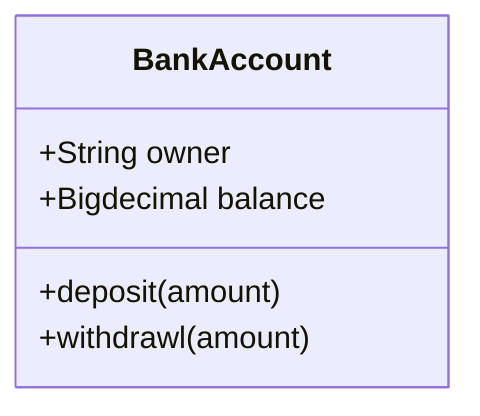
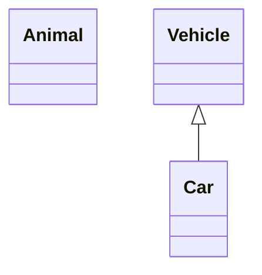
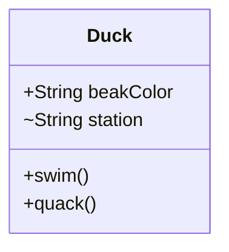
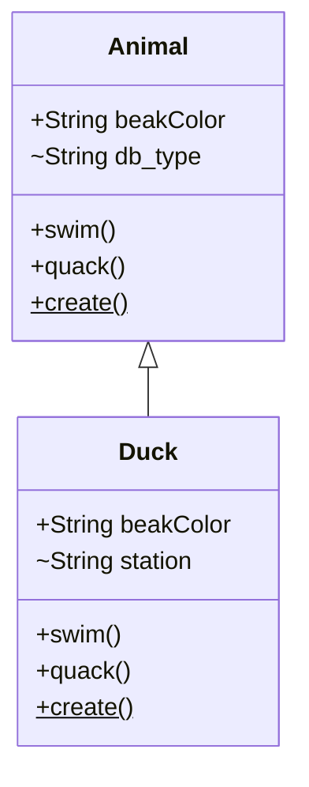
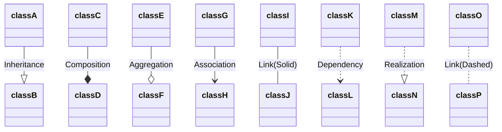
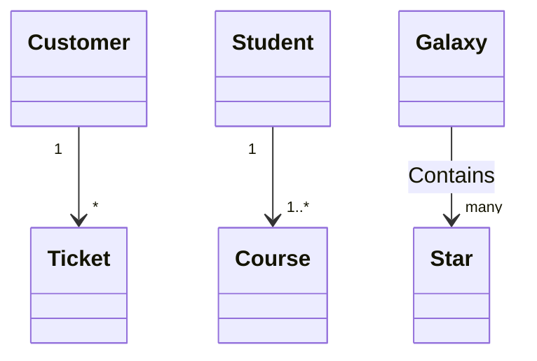
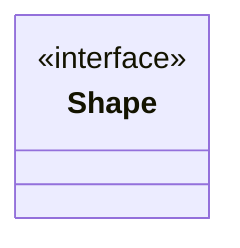
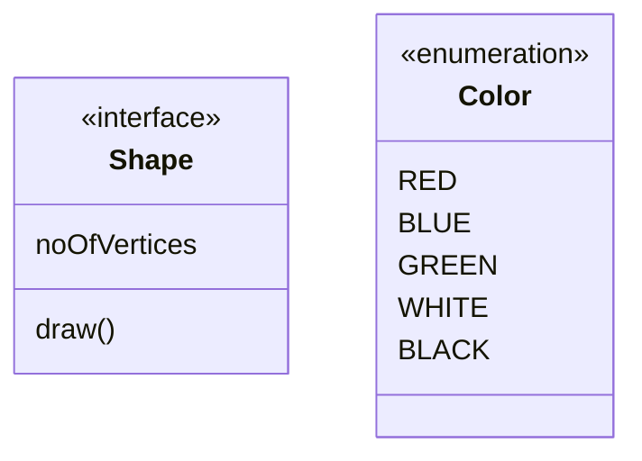
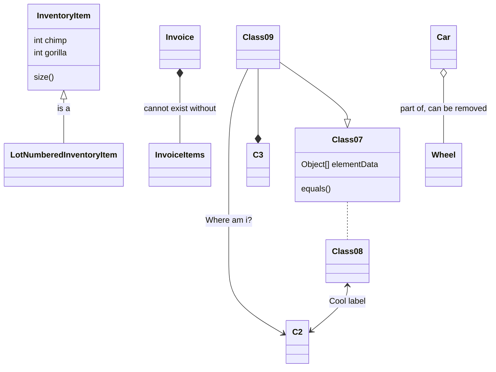

[README](/README.md) | [THE EXAMPLES](/mermaid/the-examples.md) | [TIPS](/mermaid/general/tips.md) | [ISSUES](/mermaid/general/issues.md)

# Class Diagrams in UML
Supports PlantUML syntax:
* https://plantuml.com/class-diagram

* https://www.visual-paradigm.com/guide/uml-unified-modeling-language/uml-aggregation-vs-composition/

mermaid has pretty good examples!

https://mermaid-js.github.io/mermaid/#/classDiagram?id=syntax

# Class


* name (top compartment)
    * `class ClassName`
    * see also 'Annotations' below (ie. for interface, abstract, enum, service)
* attributes (middle compartment)
    * `attributeName` - does NOT end in parenthesis
* method (bottom compartment)
    * `fnName()` - ends in parenthesis

## Defining a Class - Two Ways

* Option 1
    * Explicitly defining a class using keyword class like `class Animal`. This defines the Animal class
* Option 2
    * Define two classes via a relationship between them `Vehicle <|-- Car`. This defines two classes Vehicle and Car along with their relationship.

## Defining a Class Members - Two Ways
* Option 1
    ```bash 
    classDiagram
        class BankAccount
            BankAccount : +String owner
            BankAccount : +BigDecimal balance
            BankAccount : +deposit(amount)
            BankAccount : +withdrawal(amount)
    ```
* Option 2
    ```bash 
    classDiagram
        class BankAccount {
            +String owner
            +BigDecimal balance
            +deposit(amount)
            +withdrawl(amount)
        }
    ```

# Visibility

    
* public
    * `+` member prefix
* private
    * `-` member prefix
* protected
    * `#` member prefix
* package/internal
    * `~` member prefix

# Classifiers
* abstract
    * `*` suffix
    * `someAbstractMethod()*`
* static
    * `$` suffix
    * `someStaticMethod()$`


# Relationships



* Inheritance
    * `classA --|> classB`
* Composition
    * `classC --* classD`
* Aggregation
    * `classE --o classF`
* Association
    * `classG --> classH`
* Link(Solid)
    * `classI -- classJ`
* Dependency
    * `classK ..> classL`
* Realization
    * `classM ..|> classN`
* Link(Dashed)
    * `classO .. classP`

# Cardinality / Multiplicity on relations


* Only 1
    * `1`
* Zero or One
    * `0..1`
* One or more
    * `1..*`
* Many
    * `*`
* n {where n>1}
    * `n`
* zero to n {where n>1}
    * `0..n`
* one to n {where n>1}
    * `1..n`

# Annotations on classes
* To represent an Interface class
    * `<<Interface>>`
* To represent an abstract class
    * `<<abstract>>`
* To represent a service class
    * `<<Service>>`
* To represent an enum
    * `<<enumeration>>`

There are two ways to add an annotation to a class and regardless of the syntax used output will be same

* Option 1


* Option 2



# Comments

classDiagram
%% This whole line is a comment classDiagram class Shape <<interface>>
class Shape{
    <<interface>>
    noOfVertices
    draw()
}


# Mermaid Model Examples


