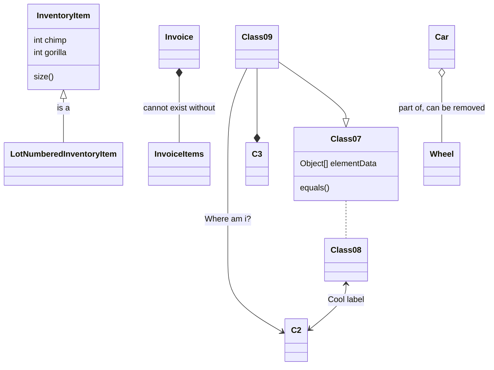

[README](../../README.md)
| 
[THE EXAMPLES](../the-examples.md)
| 
[TIPS](../general/the-examples.md)
| 
[ISSUES](../general/issues.md)

# Class Diagrams in UML

https://www.visual-paradigm.com/guide/uml-unified-modeling-language/uml-aggregation-vs-composition/

# Mermaid Model Examples

