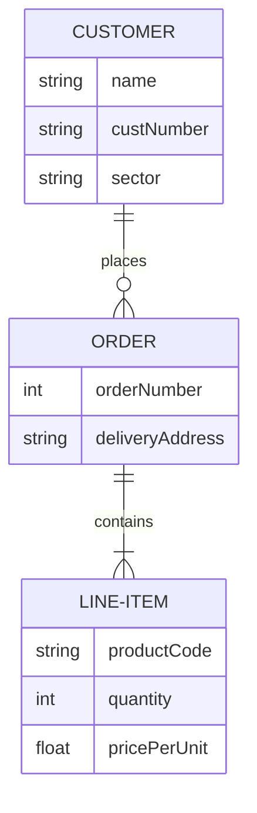
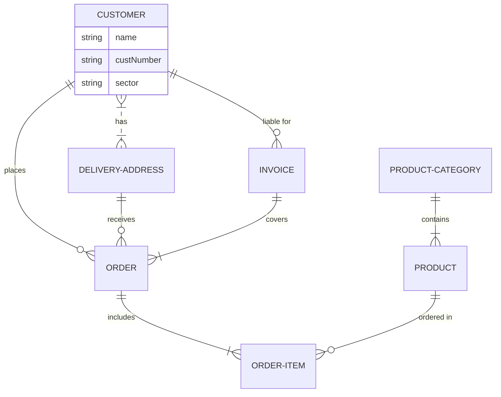

[README](/README.md) | [THE EXAMPLES](/mermaid/the-examples.md) | [TIPS](/mermaid/general/tips.md) | [ISSUES](/mermaid/general/issues.md)

# relationship types
[er - relationship syntax](https://mermaid-js.github.io/mermaid/#/entityRelationshipDiagram?id=relationship-syntax) | [mermaid-js syntax docs](https://mermaid-js.github.io/mermaid/#/)

This linkes ahove show that ER diagrams do not recognise aggregation as distinct.  

ER Diagrams can represent cardinality in each direction of a relationship

## relationships

* zero or one
    * `??--o|` = LHS has zero or one RHS entities
    * `|o--??` = RHS has zero or one LHS entities

* exactly one
    * `??--||` = RHS has exactly one LHS entity
    * `||--??` = LHS has exactly one RHS entity
    
* zero or more
    * `??--o{` = LHS has zero or more RHS entities 
    * `}o--??` = RHS has zero or more LHS entities 

* one or more
    * `??--|{` = LHS has zero or more RHS entities 
    * `}|--??` = RHS has zero or more LHS entities 

* BI directional
    * these are exactly the same
        * `ORDER ||--|{ LINE-ITEM : contains`
            * order has `|{` (one-many) line items
            * a line-item has `||` (exactly one) order
        * `LINE-ITEM }|--|| ORDER : contains`
            * order has `}|` (one-many) line items
            * a line-item has `||` (exactly one) order

## attributes

[mermaid docs - attributes](https://mermaid-js.github.io/mermaid/#/entityRelationshipDiagram?id=attributes)

# aggregate
er diagram does not support aggregate syntax

all relationships are just associations

use class diagram for aggregation (but check if it also supports cardinality)
`[LHS Entity] [LHS rel]--|{` = LHS has one or more RHS entities
* ORDER ||--|{ LINE-ITEM 

# complete example

