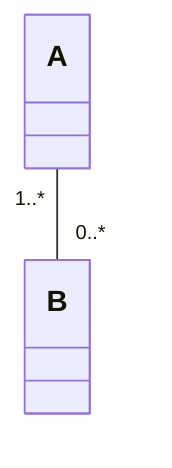

[README](/README.md) | [THE EXAMPLES](/mermaid/the-examples.md) | [TIPS](/mermaid/general/tips.md) | [ISSUES](/mermaid/general/issues.md)

# Issues

## Invisible Text

mermaid in vscode (with dark theme enabled) results in invisible text, in some cases.  

The following text "1..*" is invisible by default in vscode

Workarounds: Custom style overrides required to show.  

https://github.com/mjbvz/vscode-markdown-mermaid/issues/23

