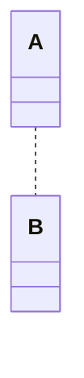
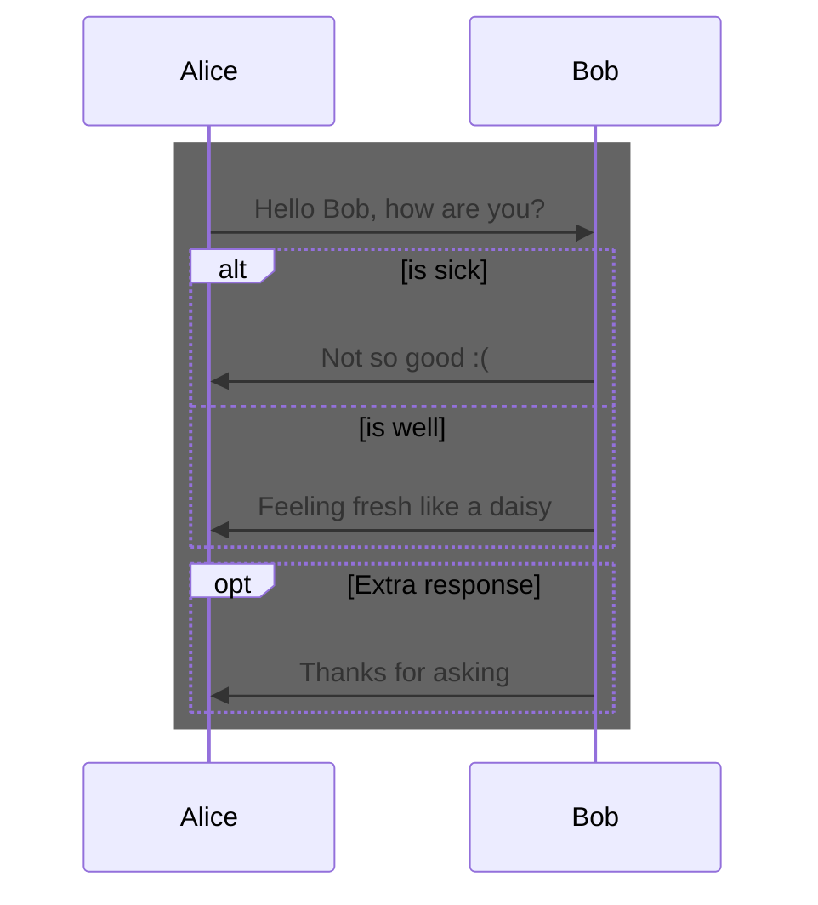
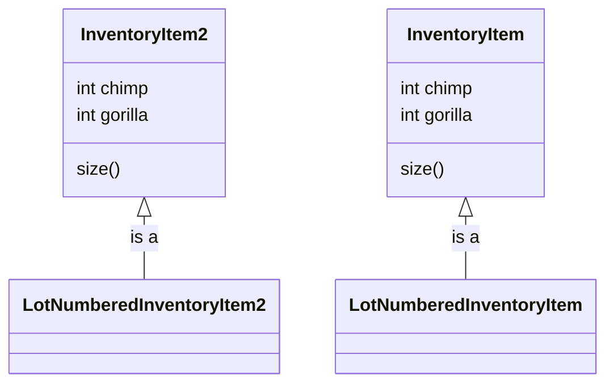

[README](/README.md) | [THE EXAMPLES](/mermaid/the-examples.md) | [TIPS](/mermaid/general/tips.md) | [ISSUES](/mermaid/general/issues.md)

# Tips

### Comments

### Color

### Identation is ignored

identation is ignored.  Therefore, use it to make the mermaid code more readable

