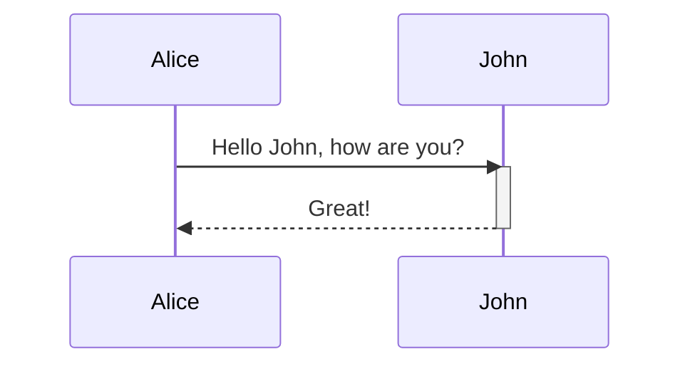
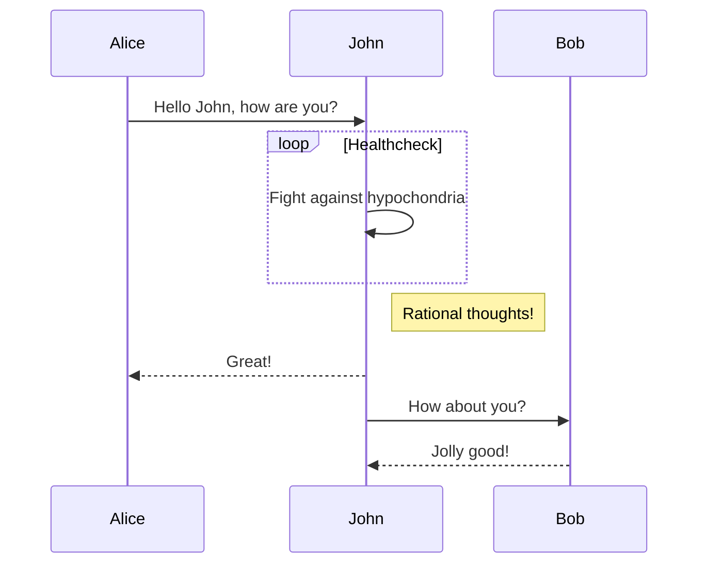

[README](/README.md) | [THE EXAMPLES](/mermaid/the-examples.md) | [TIPS](/mermaid/general/tips.md) | [ISSUES](/mermaid/general/issues.md)

reference:
* https://mermaid-js.github.io/mermaid/#/sequenceDiagram

```mermaid
sequenceDiagram
rect rgb(0, 0, 0)
    Alice->>Bob: Hello Bob, how are you?
    alt is sick
        Bob->>Alice: Not so good :(
    else is well
        Bob->>Alice: Feeling fresh like a daisy
    end
    opt Extra response
        Bob->>Alice: Thanks for asking
    end
end


```

